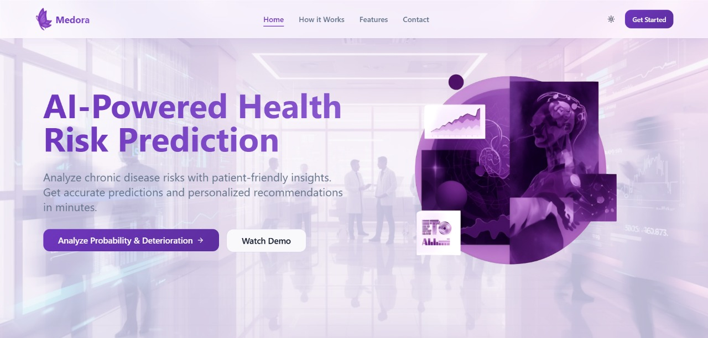
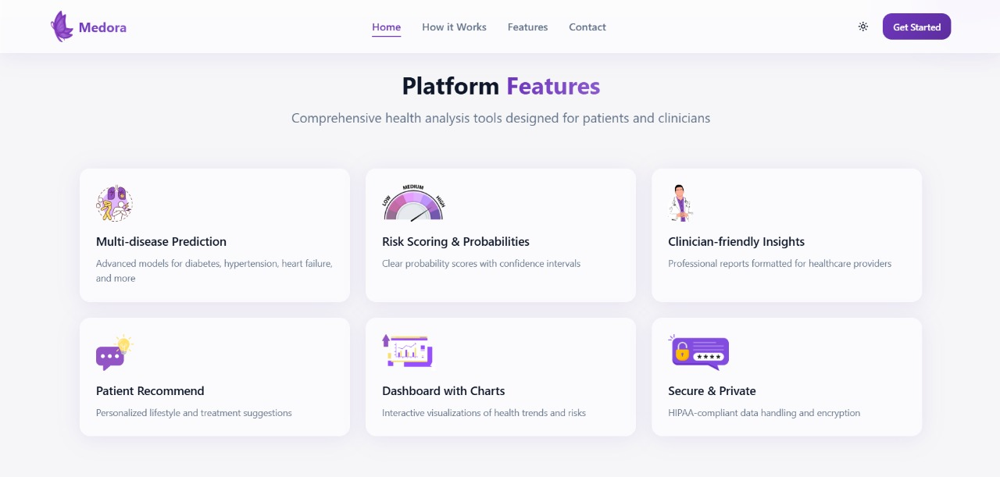
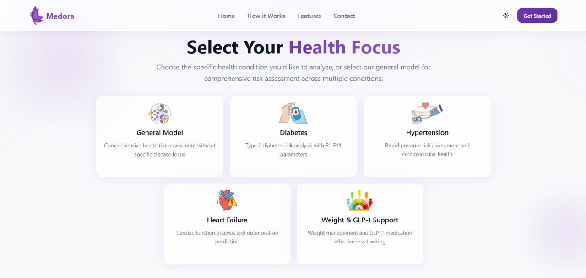
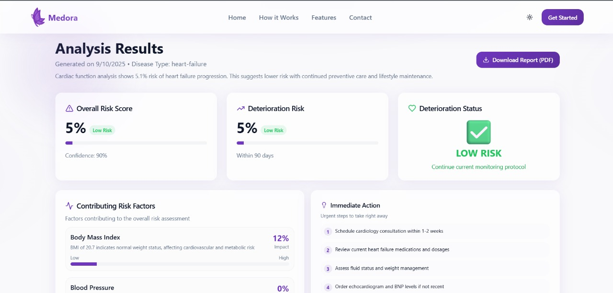
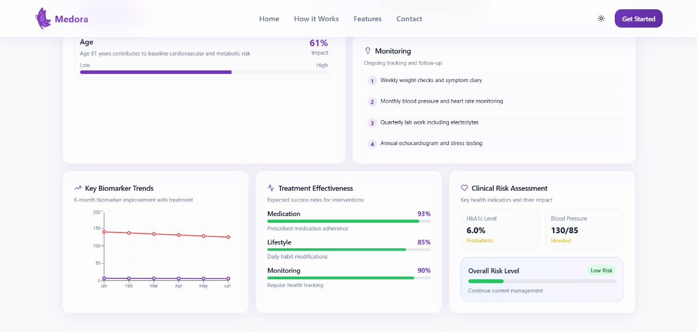
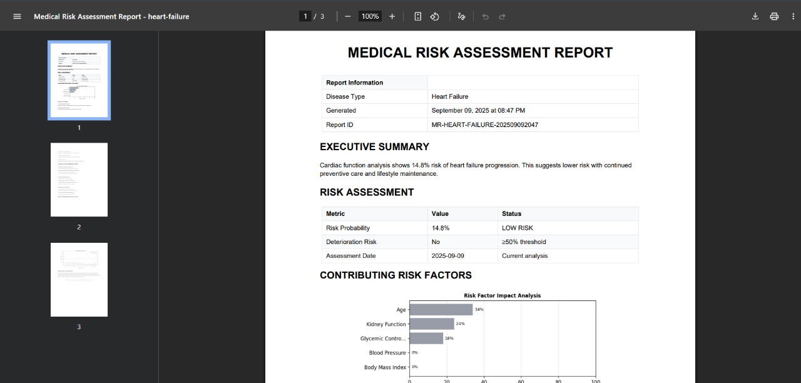
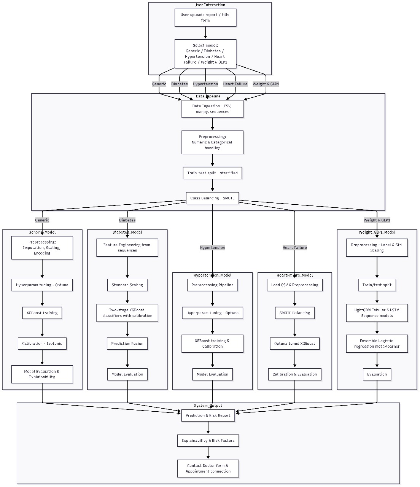
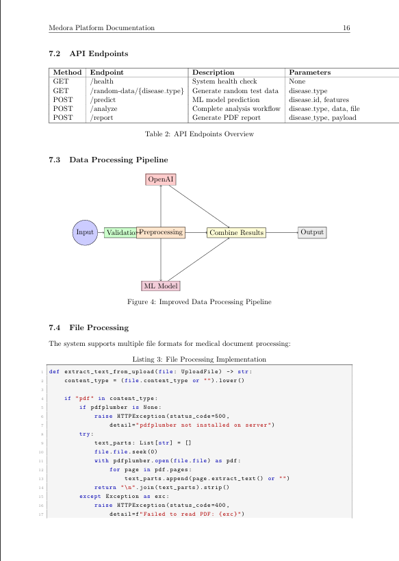
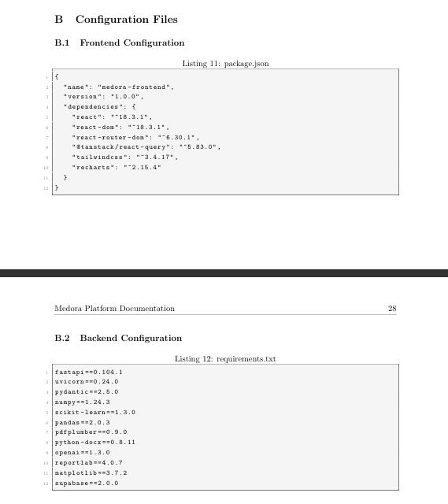

#  Medora

## AI-Powered Health Risk Prediction Platform
_Transforming healthcare through intelligent risk assessment and predictive analytics_

## Overview

Medora is a comprehensive AI-powered health risk prediction platform designed to assist healthcare providers in identifying patients at risk of health deterioration within 90 days. The platform combines advanced machine learning models with clinical expertise to provide actionable insights for preventive care and early intervention.

### Mission

To revolutionize healthcare delivery by providing accurate, evidence-based risk predictions that enable healthcare providers to make informed decisions and improve patient outcomes through proactive care management.

### Key Benefits

- **Early Detection**: Identify high-risk patients before symptoms develop
- **Improved Accuracy**: AI-powered analysis reduces human error and bias
- **Time Efficiency**: Automated processing saves healthcare provider time
- **Consistent Results**: Standardized risk assessment across all users
- **Comprehensive Analysis**: Integration of multiple data sources and biomarkers
- **Actionable Insights**: Clear recommendations for risk mitigation
- **Scalable Solution**: Can handle large volumes of patient data
- **Professional Integration**: Seamless integration with existing healthcare workflows

---

## Key Features

### Multi-Model Risk Assessment

- **5 Specialized Models**: General health, diabetes, hypertension, heart failure, and weight management
- **30-180 Day Data Window**: Flexible data collection period for comprehensive analysis
- **90-Day Prediction Horizon**: Predicts deterioration risk within the next 90 days
- **Real-time Processing**: Instant risk assessment and clinical recommendations

### Advanced Data Processing

- **Structured Data Input**: Comprehensive health parameter collection
- **Document Processing**: PDF and DOCX medical report analysis
- **Temporal Analysis**: Trend analysis and progression tracking
- **Feature Engineering**: Sophisticated data preprocessing and normalization

### Clinical Decision Support

- **Risk Stratification**: Low, moderate, and high-risk categorization
- **Factor Analysis**: Detailed breakdown of contributing risk factors
- **Evidence-Based Recommendations**: Clinical guidelines and best practices
- **Monitoring Protocols**: Personalized follow-up and monitoring schedules

### Professional Reporting

- **PDF Report Generation**: Comprehensive medical reports with charts
- **Interactive Dashboards**: Real-time visualization of risk factors and trends
- **Clinical Documentation**: Professional formatting for healthcare providers
- **Export Capabilities**: Integration with existing medical record systems

---

## Platform Screenshots

### Landing Page


_Main interface with disease selection cards and navigation_

### Features Overview


_Platform features and capabilities showcase_

### Focus Areas


_Key focus areas and specializations_

### Analysis Interface


_Data analysis interface with deterioration probability_

### Results Dashboard


_Report in PDF Format for download_

---

## Architecture

### Backend (Python/FastAPI)

- **Framework**: FastAPI with CORS middleware for high-performance API
- **ML Models**: 5 pickle-serialized machine learning models
- **File Processing**: PDF/DOCX medical report extraction and analysis
- **AI Integration**: OpenAI GPT-4 for clinical summaries and recommendations
- **Report Generation**: PDF reports with charts using ReportLab

### Frontend (React/TypeScript)

- **Framework**: React 18 with TypeScript for type safety
- **Build Tool**: Vite for fast development and building
- **UI Library**: Radix UI components with Tailwind CSS styling
- **State Management**: React hooks and context for state management
- **Routing**: React Router for single-page application navigation

### Database Integration

- **Supabase**: Real-time database for user data and analysis results
- **Data Storage**: Secure storage of patient data and analysis results
- **Authentication**: Built-in user authentication and authorization

---

## Disease Models

### 1. General Health Model

**Purpose**: Comprehensive health risk assessment across multiple conditions
**Key Parameters**: Age, BMI, blood pressure, cholesterol, lifestyle factors
**Use Case**: Primary care screening and general health monitoring

### 2. Diabetes Model

**Purpose**: Diabetes risk analysis and complication prediction
**Key Parameters**: HbA1c, fasting glucose, insulin levels, cardiovascular markers
**Use Case**: Diabetes management and prevention programs

### 3. Hypertension Model

**Purpose**: Blood pressure risk assessment and cardiovascular health
**Key Parameters**: Blood pressure, kidney function, medication adherence
**Use Case**: Cardiovascular risk management and hypertension control

### 4. Heart Failure Model

**Purpose**: Cardiac function analysis and deterioration prediction
**Key Parameters**: Ejection fraction, creatinine trends, medication compliance
**Use Case**: Heart failure management and cardiac care

### 5. Weight Management Model (GLP-1)

**Purpose**: Weight management and GLP-1 medication effectiveness
**Key Parameters**: BMI, waist circumference, medication adherence, side effects
**Use Case**: Obesity management and metabolic health programs

---

## Installation

### Prerequisites

- Node.js 18+ and npm/yarn
- Python 3.8+ and pip
- Git for version control

### Backend Setup

1. **Clone the repository**

   ```bash
   git clone https://github.com/your-org/medora-platform.git
   cd medora-platform/backend
   ```

2. **Create virtual environment**

   ```bash
   python -m venv venv
   source venv/bin/activate  # On Windows: venv\Scripts\activate
   ```

3. **Install dependencies**

   ```bash
   pip install -r requirements.txt
   ```

4. **Set environment variables**

   ```bash
   export OPENAI_API_KEY="your-openai-api-key"
   export PORT=8000
   ```

5. **Run the backend server**
   ```bash
   python main.py
   ```

### Frontend Setup

1. **Navigate to frontend directory**

   ```bash
   cd ../frontend
   ```

2. **Install dependencies**

   ```bash
   npm install
   ```

3. **Set environment variables**

   ```bash
   export VITE_API_BASE_URL="http://localhost:8000"
   ```

4. **Start development server**

   ```bash
   npm run dev
   ```

5. **Build for production**
   ```bash
   npm run build
   ```

---

## Configuration

### Environment Variables

#### Backend (.env)

```env
OPENAI_API_KEY=your-openai-api-key
PORT=8000
MODELS_DIR=./models
CORS_ORIGINS=http://localhost:3000,http://localhost:5173
```

#### Frontend (.env.local)

```env
VITE_API_BASE_URL=http://localhost:8000
VITE_SUPABASE_URL=your-supabase-url
VITE_SUPABASE_ANON_KEY=your-supabase-anon-key
```

### Model Configuration

- Place trained model files (model1.pkl - model5.pkl) in the backend directory
- Models support multiple formats: pickle, joblib, cloudpickle, XGBoost
- Fallback mechanisms ensure system reliability even if models fail to load

---

## Usage

### 1. Disease Selection

- Choose from 5 specialized disease models
- Each model is optimized for specific health conditions
- General model available for comprehensive assessment

### 2. Data Input

- **Structured Data**: Fill in health parameters through intuitive forms
- **Document Upload**: Upload PDF or DOCX medical reports
- **Random Data**: Use built-in random data generator for testing

### 3. Analysis Processing

- Real-time risk assessment using machine learning models
- AI-powered clinical summary generation
- Factor analysis and impact scoring

### 4. Results Review

- Interactive dashboard with risk visualization
- Detailed factor breakdown and explanations
- Evidence-based clinical recommendations

### 5. Report Generation

- Download comprehensive PDF reports
- Professional formatting for medical records
- Charts and visualizations for clinical presentation

---

## Clinical Decision Support

### Risk Stratification

#### Low Risk (< 30%)

- **Status**: Continue current management
- **Monitoring**: Annual comprehensive assessment
- **Interventions**: Preventive care and lifestyle maintenance

#### Moderate Risk (30-60%)

- **Status**: Intensify monitoring and interventions
- **Monitoring**: Quarterly assessments and biomarker tracking
- **Interventions**: Lifestyle modifications and medication optimization

#### High Risk (> 60%)

- **Status**: Immediate specialist referral required
- **Monitoring**: Weekly to monthly assessments
- **Interventions**: Aggressive treatment and close follow-up

### Factor Analysis

- **Impact Scoring**: 0-100% contribution to overall risk
- **Clinical Context**: Medical explanations for each factor
- **Intervention Targets**: Specific areas for clinical focus

### Evidence-Based Recommendations

- **Immediate Actions**: Urgent steps requiring immediate attention
- **Lifestyle Changes**: Long-term health improvements
- **Monitoring Protocols**: Ongoing tracking and follow-up schedules

---

## Report Generation

### PDF Report Features

- **Executive Summary**: Key findings and risk assessment
- **Risk Metrics**: Probability scores and deterioration status
- **Factor Analysis**: Detailed breakdown of contributing factors
- **Clinical Recommendations**: Evidence-based intervention strategies
- **Risk Progression**: 12-month trend analysis and projections
- **Professional Formatting**: Medical-grade documentation

### Report Sections

1. **Report Information**: Metadata and generation details
2. **Executive Summary**: Clinical overview and key findings
3. **Risk Assessment**: Probability scores and risk levels
4. **Contributing Factors**: Detailed factor analysis with impact scores
5. **Clinical Recommendations**: Categorized intervention strategies
6. **Risk Progression Analysis**: Historical trends and future projections
7. **Disclaimers**: Professional medical disclaimers and limitations

### Main Workflow



### Report Sample



### Dependencies



---

_Medora Platform - Empowering healthcare through intelligent risk prediction and clinical decision support._
